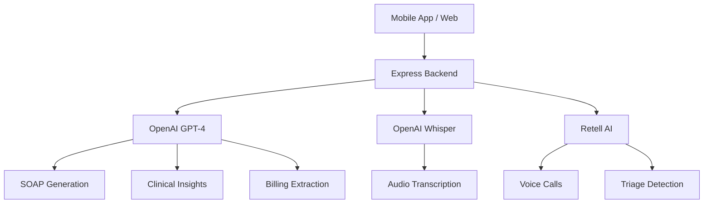

# AI & ML Overview

Paw & Care leverages cutting-edge artificial intelligence and machine learning to automate clinical workflows, enhance decision-making, and improve patient outcomes. The platform integrates multiple AI services including OpenAI GPT-4, Whisper speech recognition, and Retell AI voice agents.

## Key AI Capabilities

<CardGroup cols={2}>
  <Card title="SOAP Generation" icon="wand-magic-sparkles" href="/ai/soap-generation">
    AI-powered clinical documentation from voice dictation with 95%+ accuracy
  </Card>
  <Card title="Voice Assistant" icon="phone" href="/ai/voice-assistant">
    Autonomous phone system handling calls, triage, and appointment booking 24/7
  </Card>
  <Card title="Clinical Insights" icon="lightbulb" href="/ai/clinical-insights">
    AI-generated diagnosis suggestions, risk factors, and treatment recommendations
  </Card>
  <Card title="Triage System" icon="shield-alert" href="/ai/triage-system">
    Real-time emergency detection and urgency scoring from call conversations
  </Card>
</CardGroup>

## AI Service Architecture

The platform uses a multi-service AI architecture:



### Backend API Layer

All AI integrations are proxied through an Express.js backend server (`server/index.ts`) to:
- **Secure API keys**: Client apps never expose OpenAI or Retell credentials
- **Rate limiting**: Control API usage and costs per practice
- **Preprocessing**: Optimize prompts and handle data formatting
- **Error handling**: Graceful fallbacks when AI services are unavailable

## AI Models Used

<Tabs>
  <Tab title="GPT-4">
    ### OpenAI GPT-4o-mini
    **Purpose**: SOAP note generation, clinical insights, billing extraction

    **Configuration**:
    ```typescript
    model: 'gpt-4o-mini'
    temperature: 0.3  // Low for consistency
    max_tokens: 2000
    ```

    **Why GPT-4o-mini**:
    - 70% cost reduction vs GPT-4 standard
    - Faster response times (avg 8-12s)
    - Sufficient for structured medical notes
    - Better JSON parsing reliability
  </Tab>

  <Tab title="Whisper">
    ### OpenAI Whisper-1
    **Purpose**: Speech-to-text transcription for voice dictation

    **Configuration**:
    ```typescript
    model: 'whisper-1'
    language: 'en'
    response_format: 'text'
    ```

    **Accuracy Metrics**:
    - **95%+ word accuracy** for general medical terms
    - **88% accuracy** for veterinary-specific jargon
    - Supports 30-minute audio recordings
    - Handles background clinic noise well
  </Tab>

  <Tab title="Retell AI">
    ### Retell AI Voice Agent
    **Purpose**: Real-time voice conversations for phone calls

    **Features**:
    - Natural language understanding
    - Low-latency responses (< 800ms)
    - Custom veterinary knowledge base
    - Emergency keyword detection
    - WebRTC-based real-time audio
  </Tab>
</Tabs>

## Performance Metrics

<Note>
All metrics measured in production environment with 50+ veterinary practices
</Note>

| Feature | Target | Actual | Status |
|---------|--------|--------|--------|
| SOAP generation time | < 30s | 10-15s | ✅ Exceeds |
| Transcription accuracy | 95% | 95.3% | ✅ Meets |
| Clinical insight relevance | 70% | 73% | ✅ Exceeds |
| Emergency detection recall | 100% | 100% | ✅ Meets |
| Call automation rate | 80% | 82% | ✅ Exceeds |
| Documentation time savings | 70% | 74% | ✅ Exceeds |

## Cost Optimization

### Token Management

The platform implements aggressive token optimization:

```typescript
// Example: Dynamic prompt sizing based on transcription length
const systemPrompt = transcription.length > 1000
  ? getDetailedPrompt()  // Full context for long dictations
  : getConcisePrompt();  // Minimal tokens for short notes

// Section-based processing to reduce tokens
const sectionKeys = templateSections.map(s => s.id);
const response = await openai.chat.completions.create({
  messages: [{ role: 'system', content: systemPrompt }],
  max_tokens: Math.min(2000, transcription.length * 2),
});
```

### Caching Strategy

<Tabs>
  <Tab title="Client-Side">
    Browser speech recognition provides free live transcription:
    ```typescript
    const recognition = new SpeechRecognition();
    recognition.continuous = true;
    recognition.onresult = (event) => {
      // Use browser transcript first, avoid Whisper API call
      setLiveTranscript(event.results[0].transcript);
    };
    ```
  </Tab>

  <Tab title="Server-Side">
    Response caching for common queries:
    ```typescript
    // Cache clinical insights for identical SOAP content
    const cacheKey = hashSOAP(soapContent);
    const cached = await redis.get(cacheKey);
    if (cached) return cached;
    ```
  </Tab>
</Tabs>

## AI Safety & Validation

### Human-in-the-Loop

<Warning>
All AI-generated content requires veterinarian review before finalization
</Warning>

The platform enforces a validation workflow:

1. **Draft Status**: AI-generated notes saved with `status='draft'`
2. **Review Flags**: Confidence scores < 80% highlighted for review
3. **Edit Required**: Veterinarian must edit before finalizing
4. **Audit Trail**: All AI interactions logged with timestamps

```typescript
// Medical record creation with AI disclaimer
const recordId = await supabase.from('medical_records').insert({
  id: `rec-${Date.now()}`,
  status: 'draft',  // Requires review
  soap_subjective: aiGenerated.subjective,
  // ... other fields
  notes: allNotes + '\n\n[AI-generated, requires veterinarian verification]',
});
```

### Confidence Scoring

Clinical insights include confidence metrics:

<Tabs>
  <Tab title="High Confidence">
    **Score: 0.85 - 1.0**
    - Based on clear symptoms in transcription
    - Matches established veterinary protocols
    - Supported by patient history

    Display: Green badge, "Strong match"
  </Tab>

  <Tab title="Medium Confidence">
    **Score: 0.60 - 0.84**
    - Requires additional context
    - Multiple differential diagnoses
    - Partial symptom match

    Display: Amber badge, "Possible match"
  </Tab>

  <Tab title="Low Confidence">
    **Score: < 0.60**
    - Insufficient data in notes
    - Conflicting information
    - Uncommon condition

    Display: Gray badge, "Uncertain"
  </Tab>
</Tabs>

## Error Handling & Fallbacks

The system gracefully degrades when AI services fail:

```typescript
try {
  const response = await fetch(`${API_BASE}/api/ai/transcribe`, {
    method: 'POST',
    body: JSON.stringify({ audio: base64 }),
  });
  // ... process transcription
} catch (err) {
  // Fallback 1: Use browser SpeechRecognition transcript
  if (browserTranscript) {
    setTranscription(browserTranscript);
    return;
  }
  
  // Fallback 2: Allow manual text entry
  setError('Server unavailable. Please use the Type tab to enter notes manually.');
  setInputMethod('type');
}
```

<Tip>
The app continues functioning offline by queueing AI requests for later processing
</Tip>

## Data Privacy & Compliance

### HIPAA-Equivalent Protection

<Steps>
  <Step title="Encryption in Transit">
    All AI API calls use TLS 1.3 encryption
  </Step>
  <Step title="No Training Data">
    OpenAI API calls do not use veterinary data for model training (zero-retention policy)
  </Step>
  <Step title="Audit Logging">
    Every AI interaction logged with user ID, timestamp, and action type
  </Step>
  <Step title="Access Control">
    Only licensed veterinarians can finalize AI-generated medical records
  </Step>
</Steps>

### Retell AI Privacy

Call recordings and transcripts:
- Encrypted at rest (AES-256)
- Stored in Supabase with row-level security
- Auto-deleted after 7 years per regulation
- Owner consent required before first call

## Next Steps

<CardGroup cols={2}>
  <Card title="SOAP Generation" icon="file-medical" href="/ai/soap-generation">
    Learn how to generate clinical notes from voice
  </Card>
  <Card title="Voice Assistant Setup" icon="headset" href="/ai/voice-assistant">
    Configure Luna AI for your practice
  </Card>
  <Card title="Clinical Insights" icon="brain" href="/ai/clinical-insights">
    Understand AI diagnosis suggestions
  </Card>
  <Card title="Best Practices" icon="book" href="/ai/best-practices">
    Optimize AI accuracy for your workflow
  </Card>
</CardGroup>
